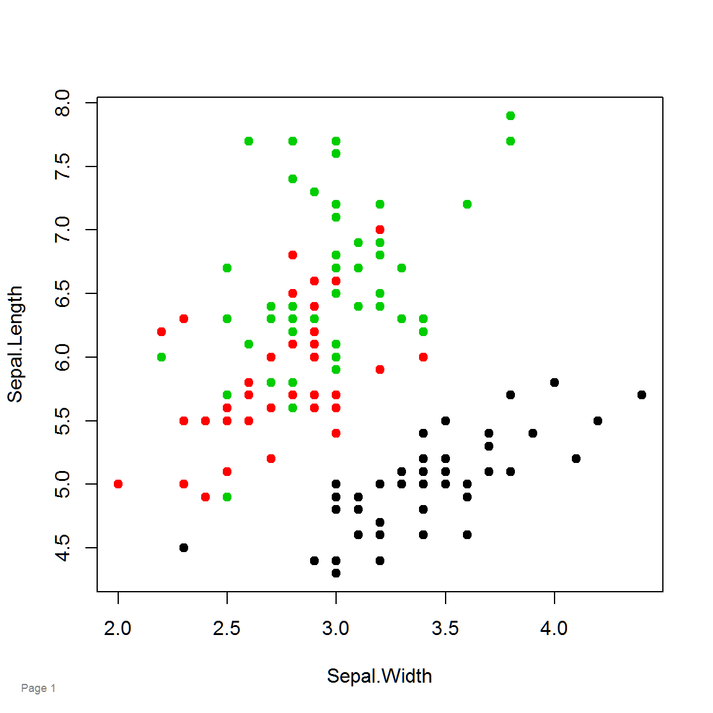

# pagenum

[](https://cran.r-project.org/package=pagenum)
[](https://cranlogs.r-pkg.org/badges/pagenum)

Homepage: https://kwstat.github.io/pagenum

Repository: https://github.com/kwstat/pagenum

This package makes it easy to automatically add a time-stamp and page number to graphics.

Key features:

* Supports base, lattice, and ggplot2 graphics.

## Installation

```R
# Install the released version from CRAN:
install.packages("pagenum")

# Install the development version from GitHub:
install.packages("devtools")
devtools::install_github("kwstat/pagenum")
```

## Usage

```R
require(pagenum)
setPagenum(1)
plot(Sepal.Length~Sepal.Width, data=iris, col=Species, pch=19)
pagenum()
```

